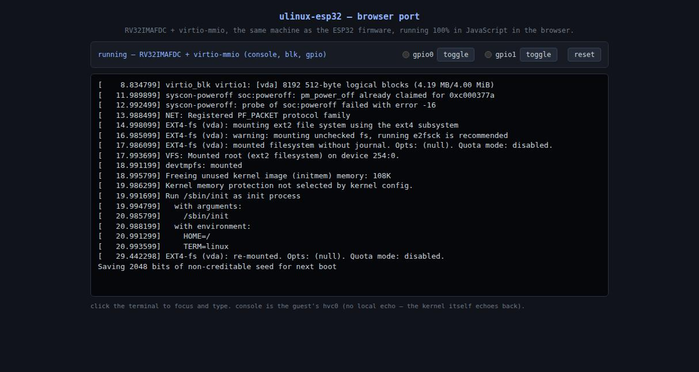

# 🐧 ESP32 Running Linux via RISC-V Emulator
This project implements a RISC-V emulator on the ESP32 microcontroller, capable of running a minimal Linux environment.

# 📄 Overview
This project enables the execution of a lightweight Linux environment on the ESP32 by emulating RISC-V instructions. It leverages the ESP32's capabilities to support basic Linux functionalities—ideal for experimentation, learning, or running simple applications that traditionally require more robust hardware.

# ⚙️ How It Works
The emulator translates RISC-V instructions into instructions compatible with the ESP32, allowing the system to simulate a RISC-V processor environment and run a minimal Linux kernel.


# 💻 Flashing and Setup (machine-esp32-s3n16r8, real hardware)
1. Create the Filesystem Image (already built and checked in as `littlefs.bin`)

```
cd machine-esp32-s3n16r8
mklittlefs -c ../data -b 4096 -p 256 -s $((8*1024*1024)) littlefs.bin
```
2. Flash the Filesystem

```
esptool.py -b 1500000 write_flash 0x100000 littlefs.bin
```
3. Build and Flash the Firmware

```
idf.py flash monitor
```

> [!NOTE]
> Make sure your ESP-IDF environment is correctly set up before starting.
> Tested with ESP32-S3 and a 16MB flash configuration.
> The Linux environment is minimal and designed for embedded purposes.
> ▶️ [I'm on YouTube!](https://youtu.be/RffAsl98R4o?si=HZfnRIMDvLjHM8QV)

# 🗂️ Project layout

Same RV32IMAFDC + virtio-mmio core, in three variants:

- **`machine-esp32-s3n16r8/`** — real hardware firmware (ESP32-S3, 16MB flash), covered above. Guest images live in a LittleFS partition; virtio-net bridges to real WiFi (`esp_wifi_internal_tx`/`esp_wifi_internal_rxcb`), so the guest gets real network access. This is the variant shown in the YouTube video above.
- **`machine-esp32-linux/`** — same core, built for ESP-IDF's `linux` target (compiles to a native host binary, no hardware needed). The CPU decoder is split out into `cpu.c`/`cpu.h`, and guest RAM is streamed through an LRU-windowed cache (`data/memory.bin`) instead of living fully resident. Used for fast local development and debugging. virtio-net exists but isn't bridged to a real interface yet (queue is drained, packets aren't forwarded anywhere).
- **`index.html`** — the same emulator ported to JavaScript, running 100% client-side in a browser. Fetches the guest images from `data/` at load time, so it needs to be served over HTTP (GitHub Pages, `python3 -m http.server`, etc.) — `file://` is blocked by CORS. Live at **https://nodestark.github.io/esp32-running-linux/**.
- **`data/`** — the four guest images shared by all three variants: `bbl32.bin` (bootloader), `Image` (kernel), `riscv_emulator.dtb`, `rootfs.ext2`.

### Running machine-esp32-linux (native, no hardware)
```
cd machine-esp32-linux
idf.py set-target linux
idf.py build
./build/ulinux-esp32.elf   # run from inside machine-esp32-linux/, it reads ../data/ as a relative path
```

### Running the browser version locally
```
python3 -m http.server 8000
```
then open `http://localhost:8000/index.html` (must run from the repo root, since it fetches `data/*` as a relative path).


